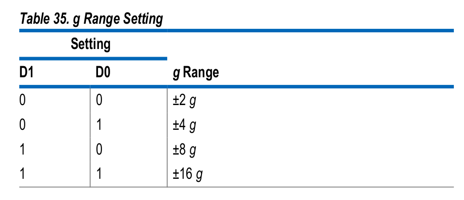
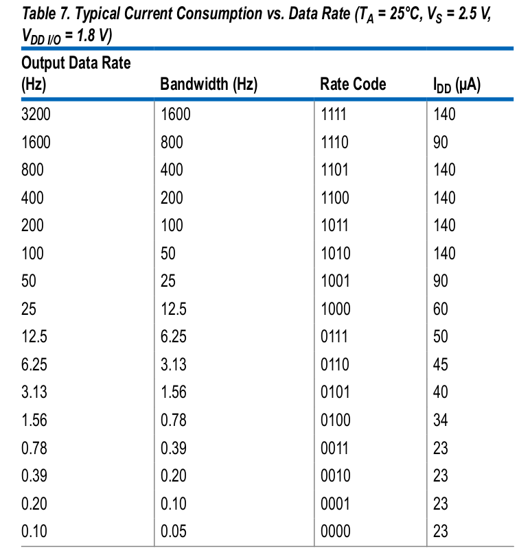

# ADXL345 driver on Micropython

## Contents
1. [At your glance](#1-at-your-glance)
2. [Requirements](#2-requirements)
3. [Quickstart](#3-quickstart)
    - [Hardware connection](#31-hardware-connection)
    - [Basic example (main.py)](#32-basic-example-mainpy)
    - [Key methods](#33-key-methods-functions)

## 1. At your glance:
- I have developed a driver for the sensor called ADXL345. To communicate with ADXL345 you can use both I2C and SPI bus serial communication, here i am using I2C bus. 
> If something goes wrong, let me know.

## 2. Requirements:
- On the folder called "01.documentation_resources" i have attached the official adxl345 datasheet provided by Analog Devices and some helpful tables used to configure and create the driver. 
- Requirements:
    - ADXL345 (sensor/accelerometer) on a breakout board
    - I2C (serial_bus_communication)

## 3. Quickstart:
### 3.1. Hardware connection
- Be aware that this connection is for a sensor on a breakout board (probably your case), otherwise you must review adxl345 datasheet.

<p align="center">
  
</p>

```text
CS -> 3.3V
SDO/ALT ADDRESS -> Ground
SDA -> SDA microcontroller Pin (check out your microcontroller datasheet)
SCL -> SCL microcontroller Pin (check out your microcontroller datasheet)
```
### 3.2. Basic example (main.py)
- This is a basic example to show how to use the key methods.

```python
import time
from machine import Pin, I2C
from adxl345 import ADXL345

# 1. Initialize I2C object 
#   I2C(bus, SCL pin, SDA pin, freq(optional))
i2c = I2C(0, scl=Pin(22), sda=Pin(21), freq=400000)

# 2. Initialize ADXL345 constructure
sensor = ADXL345(i2c)

# 3. Configure resolution and bit rate
sensor.resolution(4)        
# Configure the range (Options: 2, 4, 8, 16)
sensor.set_data_rate(100)   
# Configure data rate (Options: 50, 100, 200, 400)

# 4. Getting acceleration
while True:
    x, y, z = sensor.get_acceleration()
    print(f"X: {x:+.3f} g  |  Y: {y:+.3f} g  |  Z: {z:+.3f} g")
    time.sleep(1)
```

### 3.3 Key methods (functions)

1. object.get_acceleration():
    - Does not need any input argument
    - It returns a tuple with three values x, y, z on units g (Earth gravity)
    - The sensor change its scale factor depending on its resolution. Thus, it is necessary to first declare the resolution. If you don't initialize object.resolution() the program will work because i have initialized the resolution value as +/- 2g by default, but if you don't choose a right resolution you could get wrong or innacurate values.

2. object.resolution(resolution): 
    - It needs one argument, choose any of the following values:
    +/-[2, 4, 8, 16] g.
    - It sets up sensivility.

<p align="center">
  
</p>

3. object.set_data_rate(data_rate_hz): 
    - It needs one argument, choose any of the following values:
    [50, 100, 200, 400] Hz.
    - It sets up how fast sensor sends data to the microcontroller.
    - It has just been set up 4 rate values, they are based on Table7 of adxl345 datasheet.

<p align="center">
  
</p>

3) Referencia de la API

4) Detalles de Implementacion y Registros


