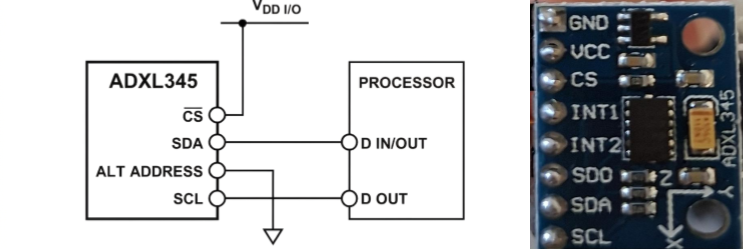

# ***ADXL345 driver on MicroPython***

## ***Contents***
1. [Short description](#1-short-description)
2. [Resources](#2-resources)
3. [Quickstart](#3-quickstart)
    - 3.1. [Hardware connection](#31-hardware-connection)
    - 3.2. [Example](#32-example)
4. [API Reference](#4-api-reference)
    - 4.1. [ADXL345()](#41-adxl345-constructor)
    - 4.2. [object.get_acceleration()](#42-objectget_acceleration-method)
    - 4.3. [object.resolution()](#43-objectresolutionresolution-method)
    - 4.4. [object.set_data_rate()](#44-objectset_data_ratedata_rate_hz-method)
5. [Initialization Sequence and Registers](#5-initialization-sequence-and-registers)
    - 5.1. [Initialization Sequence](#51-initialization-sequence)
    - 5.2. [Registers](#52-used-register-map)
6. [Interaction with I2C library](#6-interaction-with-i2c-library)
    - 6.1 [I2C()](#61-i2cid--scl-sda-freq400000-timeout50000)
    - 6.2 [object.scan()](#62-objectscan)
    - 6.3 [object.readfrom_mem()](#63-objectreadfrom_memaddr-memaddr-nbytes--addrsize8)
    - 6.4 [object.writeto_mem()](#64-objectwriteto_memaddr-memaddr-buf--addrsize8)


## ***1. Short description***
- This is a driver for the on-board accelerometer ADXL345. I2C is the medium of communication.
- You can use this driver (adxl345.py) for any microcontroller that supports MicroPython.

## ***2. Resources***
- In the folder called `01.documentation_resources`, I have attached the official ADXL345 datasheet provided by Analog Devices, and some images  extracted from the datasheet as well as a real picture of the sensor. 
- Links:
    - ADXL345 Datasheet: https://www.analog.com/en/products/adxl345.html
    - Micropython I2C library: https://docs.micropython.org/en/latest/library/machine.I2C.html

## ***3. Quickstart***
### ***3.1. Hardware connection***
- The left-hand image is a general diagram for the sensor connection to the microcontroller. The right-hand image is a picture of the sensor, as you can notice it has other pins used for different purposes.

<p align="center">
  
</p>

- Sensor Connection:
    - **GND** -> Ground
    - **VCC** -> 3.3V
    - **CS** -> 3.3V
    - **INT1** -> No connection
    - **INT2** -> No connection
    - **SDO/ALT ADDRESS** -> Ground
    - **SDA** -> SDA microcontroller Pin (check out your microcontroller's datasheet)
    - **SCL** -> SCL microcontroller Pin (check out your microcontroller's datasheet)

- Be aware that this connection only works for an on-board sensor (probably your case); otherwise, you will have to add a couple of pull-up resistors next to the SDA/SCL GPIOs (review the ADXL345 datasheet).

### ***3.2. Example***
- This example shows you how to basically use the driver.

```python
import time
from machine import Pin, I2C
from adxl345 import ADXL345

#   Setting up I2C object
i2c = I2C(0, scl=Pin(22), sda=Pin(21), freq=400000)

#   Initializing ADXL345 constructor
sensor = ADXL345(i2c)

#   Configuring resolution and data rate
sensor.resolution(4) # (Options: 2, 4, 8, 16)
sensor.set_data_rate(100) # (Options: 50, 100, 200, 400)

#   Getting acceleration
while True:
    x, y, z = sensor.get_acceleration()
    print(f"X:{x:+.3f}g  |  Y:{y:+.3f}g  |  Z:{z:+.3f}g")
    time.sleep(2)
```

## ***4. API Reference***

### ***4.1. ADXL345() [constructor]***
- Arguments: You must enter an I2C object.
- Output: None.
- Description: It sets up the connection between the accelerometer and the microcontroller via the I2C communication bus. It also sets the sensor resolution to 2 by default. If an error message appears on your screen, it is probably because of a wrong hardware connection.

### ***4.2. object.get_acceleration() [method]***
- Arguments: It does not need any argument.
- Output: It returns a tuple with three values (x, y, z) in "g" (Earth gravity) units.
- Description: It gets the acceleration values in g units. The sensor changes its scale factor depending on its resolution; thus, it is always necessary to declare the resolution at first. If you don't initialize object.resolution(), the program will still work because I have initialized the resolution value to +/- 2g by default. 

### ***4.3. object.resolution(resolution) [method]***
- Arguments: It needs only one argument. Choose any of the following values: [2, 4, 8, 16] (corresponding to +/- 2g, 4g, 8g, or 16g).
- Output: None.
- Description: It sets up the resolution (sensitivity). If you don't use any of the provided values, you will get an error message. If you don't use an appropriate resolution, you could get invalid data.

### ***4.4. object.set_data_rate(data_rate_hz) [method]***
- Arguments: It needs only one argument. Choose any of the following values: [50, 100, 200, 400] Hz.
- Output: None.
- Description: It sets up how fast the sensor sends data to the microcontroller in Hz. Only 4 data rate values have been implemented. However, as you can see in table 7, it is possible to configure many other rate values.

## ***5. Initialization Sequence and Registers***

### ***5.1. Initialization Sequence***

 - I2C connection: The constructure saves `0x53` (`_I2C_ADDR`) as an attribute to be used later.

- Identity Validation: The constructor reads 1 byte from register `0x00` (`_REG_DEVID`). If the returned value does not match `0xE5` (`_ID_EXPECTED`), the driver halts execution and raises a `RuntimeError`. This mechanism ensures that the physical wiring and the I2C address (`0x53`) are correct before proceeding.

- Power Enablement: The driver writes `0x08` (`_ENABLE_MEASURE`) into register `0x2D` (`_REG_POWER_CTL`). This transitions the sensor from Standby Mode (low power, no data updates) to Measurement Mode.

- Default Range Selection: It sets the internal tracking variable `_RESOLUTION` to `0b00` and automatically invokes the `resolution(2)` method to establish a baseline dynamic range of $\pm 2g$.


### ***5.2. Used Register Map***

- The driver does not modify the entire ADXL345 register map. Instead, it interacts exclusively with the following specific control and data memory addresses:

| Address | Register Name | Access | Applied Value / Mask | Driver Purpose |
| :--- | :--- | :---: | :---: | :--- |
| `0x00` | `_REG_DEVID` | R | `0xE5` | Device ID |
| `0x2C` | `_REG_BW_RATE` | W | `0x09` to `0x0C` | Data rate |
| `0x2D` | `_REG_POWER_CTL` | W | `0x08` | Enable measure |
| `0x31` | `_REG_DATA_FORMAT` | R/W | Mask `0b11111100` | Data format control (resolution) |
| `0x32` to `0x37` | `_REG_DATAX0` to `_REG_DATAZ1` | R | - | X, Y, Z Axis values |

## ***6. Interaction with I2C library***

- The driver is based on and relies on the I2C library (written by micropython creators). The following methods are used to build up the driver.

### ***6.1. I2C(id, scl, sda, freq=400000, timeout=50000)***
- It constructs and returns a new I2C object using the specified parameters.
- `id` identifies a particular I2C peripheral. Since some microcontrollers have more than one, make sure to select the correct one.
- `scl` must be a Pin object specifying the SCL line.
- `sda` must be a Pin object specifying the SDA line.
- `freq` is an integer that sets the maximum frequency for SCL.
- `timeout` is the maximum time in microseconds allowed for I2C transactions.
### ***6.2. object.scan()***
- Scans all I2C peripheral addresses between 0x08 and 0x77 inclusive and returns a list of those that respond. This makes it easy to identify which peripherals are connected.

### ***6.3. object.readfrom_mem(addr, memaddr, nbytes, addrsize=8)***
- Reads `nbytes` from the peripheral specified by `addr`, starting from the memory address specified by `memaddr`. The `addrsize` argument specifies the register address size in bits.

### ***6.4. object.writeto_mem(addr, memaddr, buf, addrsize=8)***
- Writes the buffer `buf` to the peripheral specified by `addr`, starting from the memory address specified by `memaddr`.

## Authors & Contributors
* **Victor Caipo** (Author) - [GitHub](https://github.com/VictorCaipo)


