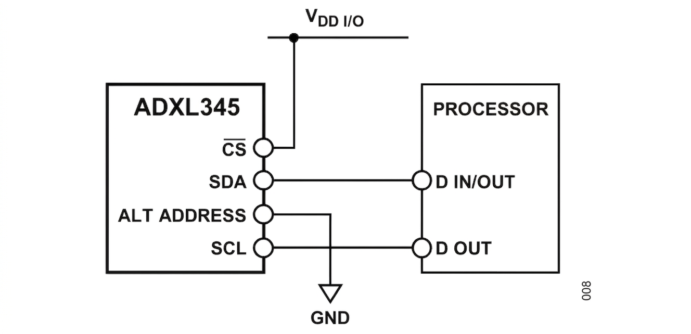

# ADXL345 driver on Mycropython

## Contents
1. [At your glance](#1.-at-your-glance:)
2. [Requirements](#2.-requirements)
3. [Quickstart](#cómo-usarlo)

## 1. At your glance:
- I have developed a driver for the sensor called ADXL345. To communicate with ADXL345 you can use both I2C and SPI bus serial communication, here i am using I2C bus. 
> If something goes wrong, let me know.

## 2. Requirements:
- On the folder called "01.documentation_resources" i have attached the official adxl345 datasheet provided by Analog Devices. 
- Tools:
    - ADXL345 (sensor/accelerometer)
    - I2C (serial_bus_communication)

## 3. Quickstart:
### 3.1. Hardware connection
- Be aware that this connection is for a sensor on a breakout board (probably your case), otherwise you must review adxl345 datasheet.
<p align="center">
  
</p>

```text
CS -> 3.3V
SDO/ALT ADDRESS -> Ground
SDA -> SDA microcontroller Pin (check out your microcontroller datasheet)
SCL -> SCL microcontroller Pin (check out your microcontroller datasheet)
```
### 3.2. Basic sample
- This is a basic example of how you can use this driver.

```python
import time
from machine import Pin, I2C
from adxl345 import ADXL345

# 1. Initialize I2C object 
#   I2C(bus, SCL pin, SDA pin, freq(optional))
i2c = I2C(0, scl=Pin(22), sda=Pin(21), freq=400000)

# 2. Initialize ADXL345 constructure
sensor = ADXL345(i2c)

# 3. Configure resolution and bit rate
sensor.resolution(4)        
# Configura el rango a +/- 4g (Opciones: 2, 4, 8, 16)
sensor.set_data_rate(100)   
# Configura la velocidad a 100 Hz (Opciones: 50, 100, 200, 400)

# 4. Getting acceleration

while True:
    x, y, z = sensor.get_acceleration()
    print(f"X: {x:+.3f} g  |  Y: {y:+.3f} g  |  Z: {z:+.3f} g")
    time.sleep(1)
```
2. metodos clave disponible
sensor.get_acceleration(): Devuelve una tupla (x, y, z) con los valores de aceleración escalados en unidades $g$ (gravedad terrestre).sensor.resolution(resl): Cambia el rango de medición. Valores aceptados: 2, 4, 8, o 16.sensor.set_data_rate(rate_hz): Cambia la tasa de actualización de datos en Hz. Valores aceptados: 50, 100, 200, o 400.

3) Referencia de la API

4) Detalles de Implementacion y Registros


