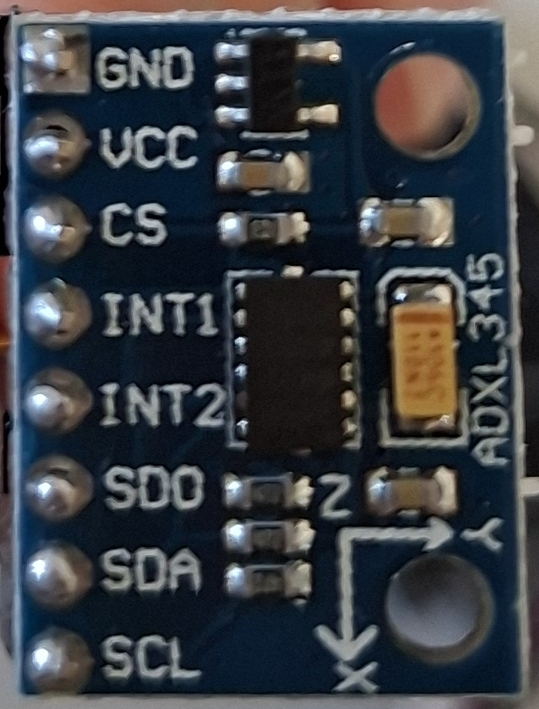

# ***ADXL345 driver on MicroPython***

## ***Contents***
1. [Short description and requirements](#1-short-description-and-requirements)
2. [Quickstart](#2-quickstart)
    - [Hardware connection](#21-hardware-connection)
    - [Example (main.py)](#22-example-mainpy)
3. [API Reference](#3-api-reference)
4. [Implementation details and registers](#4-implementation-details-and-registers)

## ***1. Short description and requirements***
- This is a sensor driver for an accelerometer named the ADXL345. It can work with both I2C and SPI; however, in this case, I am using the I2C bus. 
- In the folder called `01.documentation_resources`, I have attached the official ADXL345 datasheet provided by Analog Devices, among others. 
- What do you need to work with this driver?
    - An ADXL345 sensor/accelerometer "on a breakout board".
    - An I2C serial bus connection.
    - A compatible microcontroller.

## ***2. Quickstart***
### 2.1. Hardware connection
- Be aware that this connection only works for an on-board sensor (probably your case); otherwise, you will have to add a couple of pull-up resistors next to the SDA/SCL GPIOs (review the ADXL345 datasheet).

<p align="center">
  
</p>

- Sensor Connection:
    - **GND** -> Ground
    - **VCC** -> 3.3V
    - **CS** -> 3.3V
    - **INT1** -> No connection
    - **INT2** -> No connection
    - **SDO/ALT ADDRESS** -> Ground
    - **SDA** -> SDA microcontroller Pin (check out your microcontroller's datasheet)
    - **SCL** -> SCL microcontroller Pin (check out your microcontroller's datasheet)

<p align="center">
  
</p>

### 2.2. Example (main.py)
- This is a basic example to show how to use the key methods.

```python
import time
from machine import Pin, I2C
from adxl345 import ADXL345

#   Setting up I2C object
i2c = I2C(0, scl=Pin(22), sda=Pin(21), freq=400000)

#   Initializing ADXL345 constructor
sensor = ADXL345(i2c)

#   Configuring resolution and data rate
sensor.resolution(4) # (Options: 2, 4, 8, 16)
sensor.set_data_rate(100) # (Options: 50, 100, 200, 400)

#   Getting acceleration
while True:
    x, y, z = sensor.get_acceleration()
    print(f"X:{x:+.3f}g  |  Y:{y:+.3f}g  |  Z:{z:+.3f}g")
    time.sleep(2)
```

## ***3. API Reference***

- 3.1. ADXL345() [constructor]
    - Arguments: You must enter an I2C object.
    - Output: None.
    - Description: It sets up the connection between the accelerometer and the microcontroller via the I2C communication bus. It also sets the sensor resolution to 2 by default. If an error message appears on your screen, it is probably because of a wrong hardware connection.

- 3.2. object.get_acceleration() [method]
    - Arguments: It does not need any argument.
    - Output: It returns a tuple with three values (x, y, z) in "g" (Earth gravity) units.
    - Description: It gets the acceleration values in g units. The sensor changes its scale factor depending on its resolution; thus, it is always necessary to declare the resolution at first. If you don't initialize object.resolution(), the program will still work because I have initialized the resolution value to +/- 2g by default. 

- 3.3. object.resolution(resolution) [method]
    - Arguments: It needs only one argument. Choose any of the following values: [2, 4, 8, 16] (corresponding to +/- 2g, 4g, 8g, or 16g).
    - Output: None.
    - Description: It sets up the resolution (sensitivity). If you don't use any of the provided values, you will get an error message. If you don't use an appropriate resolution, you could get invalid data.

<p align="center">
  
</p>

- 3.4. object.set_data_rate(data_rate_hz) [method] 
    - Arguments: It needs only one argument. Choose any of the following values: [50, 100, 200, 400] Hz.
    - Output: None.
    - Description: It sets up how fast the sensor sends data to the microcontroller in Hz. Only 4 data rate values have been implemented. However, as you can see in table 7, it is possible to configure many other rate values.

<p align="center">
  
</p>

-  3.5. object.set_data_rate(data_rate_hz) [method] 
    - Arguments: it needs only one argument, choose any of the following values: [50, 100, 200, 400] Hz.
    - Output: none
    - Description: it sets up how fast sensor sends data to the microcontroller at "Hz. It has just been set up 4 rate values. However, as you can see on table 7 it is possible to configure many other rate values.

<p align="center">
  
</p>

### ***4. Implementation details and registers***

- 4.1. Initialization Sequence:
    1. Identity Validation: The constructor reads 1 byte from register `0x00` (`_REG_DEVID`). If the returned value does not match `0xE5` (`_ID_EXPECTED`), the driver halts execution and raises a `RuntimeError`. This mechanism ensures that the physical wiring and the I2C address (`0x53`) are correct before proceeding.
    2. Power Enablement: The driver writes `0x08` (`_ENABLE_MEASURE`) into register `0x2D` (`_REG_POWER_CTL`). This transitions the sensor from Standby Mode (low power, no data updates) to Measurement Mode.
    3. Default Range Selection: It sets the internal tracking variable `_RESOLUTION` to `0b00` and automatically invokes the `resolution(2)` method to establish a baseline dynamic range of $\pm 2g$.


- 4.2. Used Register Map:
    - The driver does not modify the entire ADXL345 register map. Instead, it interacts exclusively with the following specific control and data memory addresses:

| Address | Register Name | Access | Applied Value / Mask | Driver Purpose |
| :--- | :--- | :---: | :---: | :--- |
| `0x00` | `_REG_DEVID` | R | `0xE5` | Chip signature verification during object instantiation. |
| `0x2C` | `_REG_BW_RATE` | W | `0x09` to `0x0C` | Adjusts the Output Data Rate (ODR) from 50 Hz up to 400 Hz. |
| `0x2D` | `_REG_POWER_CTL` | W | `0x08` | Sets the `Measure` bit to 1, enabling continuous sensor sampling. |
| `0x31` | `_REG_DATA_FORMAT` | R/W | Mask `0b11111100` | Manages the dynamic G-range by manipulating bits `D1` and `D0`. |
| `0x32` to `0x37` | `_REG_DATAX0` to `_REG_DATAZ1` | R | - | 6-byte block containing raw twos-complement acceleration data (LSB and MSB per axis). |

> Victor Caipo


